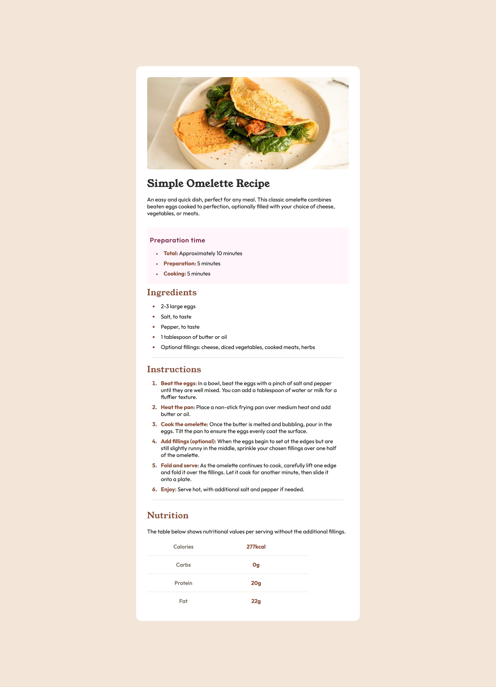

# Frontend Mentor - Recipe Page Solution

This is a solution to the [Recipe page challenge on Frontend Mentor](https://www.frontendmentor.io/challenges/recipe-page-KiTsR8s60o). Frontend Mentor challenges help you improve your coding skills by building realistic projects. 

## Table of contents

- [Overview](#overview)
  - [The challenge](#the-challenge)
  - [Screenshot](#screenshot)
  - [Links](#links)
- [My process](#my-process)
  - [Built with](#built-with)
  - [What I learned](#what-i-learned)
- [Author](#author)

## Overview

### The challenge
The challenge was to build out this recipe page and get it looking as close to the design as possible using HTML and CSS.

### Screenshot
 

### Links
- Solution URL: (https://github.com/kiyotaka-codes/recipe-page)
- Live Site URL: (https://kiyotaka-codes.github.io/recipe-page/)

## My process

### Built with
- Semantic HTML5 markup
- CSS custom properties (Variables)
- Flexbox
- Mobile-first workflow

### What I learned
During this project, I learned how to handle complex layouts with CSS Flexbox and how to make a page fully responsive without horizontal scrolling issues.

```css
/* Example of a CSS snippet I'm proud of */
.recipe-page {
    max-width: 650px;
    margin: 0 auto;
}
```
## Author
GitHub - @kiyotaka-codes
Frontend Mentor - @kiyotaka-codes